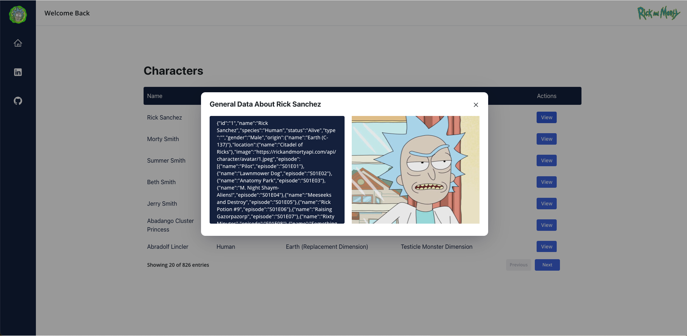

# Rick and Morty Project

## Running The Project:

- The app will be available at http://localhost:8080/ after running the following command:

```
cd client && npm run build && cd ../server && npm start

```




## General Description: (were not implemented in UI):

- UI displays Rick and Morty character data
- Pagination functionality with in-memory caching
- Every character and its features can be viewed in a detailed dialog

## Additional Backend Features (not implemented in UI):

- Auth module - Login, Register, Session
- Add a .env file on the server to enable additional features (can work without).

```
PORT=<your port>
MONGO_URI=<mongodb uri>
HASH_SALT=<hash salt number>
ACCESS_TOKEN_TTL=<milliseconds>
PRIVATE_KEY=<secret>
ORIGIN=<origin url>
```
